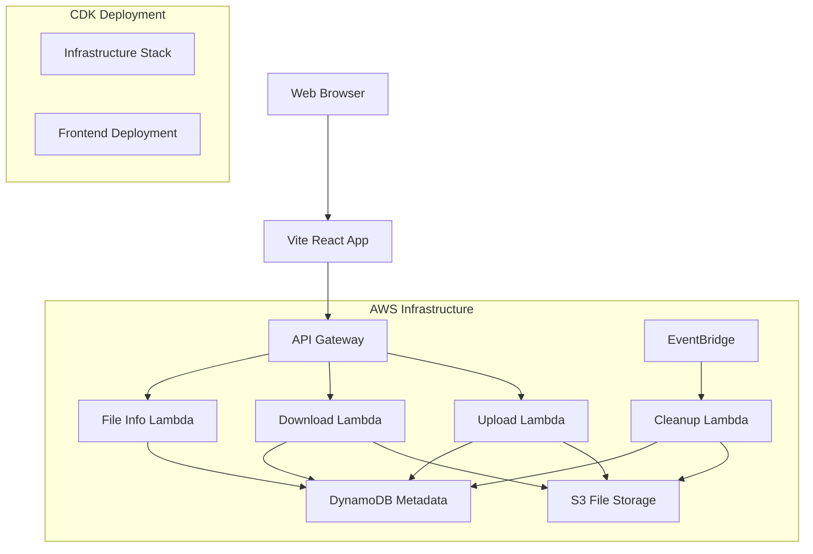

# Design Document

## Overview

The anonymous file sharing web application is a privacy-focused, simple file sharing solution that allows users to upload files without registration and share them via generated links. The system emphasizes security through file type restrictions, optional password protection, and automatic file expiration after 48 hours.

## Architecture

### System Architecture

The application follows a serverless architecture using AWS services:



### Technology Stack

- **Frontend**: Vite + React.js with TypeScript for type safety
- **Backend**: AWS Lambda functions with Node.js runtime
- **Database**: AWS DynamoDB for metadata storage
- **File Storage**: AWS S3 for secure file storage
- **Infrastructure**: AWS CDK for infrastructure as code
- **Background Jobs**: AWS EventBridge + Lambda for cleanup tasks
- **Security**: bcrypt for password hashing, crypto for unique ID generation
- **Deployment**: CDK for complete infrastructure and frontend deployment

## Components and Interfaces

### Frontend Components

#### 1. Upload Component

- File drag-and-drop interface with clear file type acceptance indicators
- Real-time progress bar showing percentage completion and estimated time remaining
- Optional password input field for file protection
- File type validation feedback with specific error messages
- File size validation with clear size limit display
- Success state with shareable link display and copy-to-clipboard functionality
- Retry mechanism for failed uploads

#### 2. Download Component

- File information display
- Password input for protected files
- Download button with proper file serving
- Error handling for expired/invalid links

#### 3. Shared Components

- File type indicator
- Copy-to-clipboard functionality
- Error message display
- Loading states

### Backend API Endpoints

#### POST /api/upload

```typescript
interface UploadRequest {
  file: File;
  password?: string;
}

interface UploadResponse {
  success: boolean;
  shareId: string;
  shareUrl: string;
  expiresAt: string;
  fileName: string;
  fileSize: number;
}
```

#### GET /api/file/:shareId

```typescript
interface FileInfoResponse {
  success: boolean;
  fileName: string;
  fileSize: number;
  uploadedAt: string;
  expiresAt: string;
  isPasswordProtected: boolean;
}
```

#### POST /api/download/:shareId

```typescript
interface DownloadRequest {
  password?: string;
}

// Returns file stream or error response
```

### Database Schema

#### DynamoDB Files Table

```typescript
// Primary Key: shareId (String)
// TTL Attribute: expiresAt (Number - Unix timestamp)

interface DynamoDBFileRecord {
  shareId: string; // Partition Key
  originalFilename: string;
  s3Key: string; // S3 object key
  fileSize: number;
  mimeType: string;
  passwordHash?: string;
  uploadedAt: number; // Unix timestamp
  expiresAt: number; // Unix timestamp (TTL)
  downloadCount: number;
}

// Global Secondary Index (optional for analytics)
// GSI: uploadedAt-index for time-based queries
```

## Data Models

### Design Rationale for Key Components

#### Share ID Generation

The system uses `crypto.randomBytes(16).toString('hex')` to generate 32-character hexadecimal share IDs. This approach ensures:

- Non-guessable URLs that protect against enumeration attacks (Requirement 2.4)
- Sufficient entropy to prevent collisions even at scale
- URL-safe characters that work across all browsers and systems

#### File Type Validation Strategy

The dual validation approach (extension + MIME type) addresses security concerns:

- Extension validation provides user-friendly feedback during file selection
- MIME type validation prevents bypass attempts using renamed files
- Both validations occur client-side for immediate feedback and server-side for security
- Clear error messages guide users toward acceptable file types (Requirement 6.2)

#### Progress Tracking Implementation

Real-time upload progress enhances user experience by:

- Using XMLHttpRequest progress events for accurate percentage tracking
- Calculating estimated time remaining based on upload speed
- Providing visual feedback to prevent user abandonment during large uploads
- Enabling retry functionality when uploads fail (Requirement 5.4)

### File Model

```typescript
interface FileRecord {
  shareId: string;
  originalFilename: string;
  s3Key: string;
  fileSize: number;
  mimeType: string;
  passwordHash?: string;
  uploadedAt: number; // Unix timestamp
  expiresAt: number; // Unix timestamp (TTL)
  downloadCount: number;
}
```

### Upload Configuration

```typescript
interface UploadConfig {
  maxFileSize: number; // 100MB
  allowedExtensions: string[];
  allowedMimeTypes: string[];
  expirationHours: number; // 48 hours
}

const ALLOWED_EXTENSIONS = [
  ".txt",
  ".pdf",
  ".doc",
  ".docx",
  ".xls",
  ".xlsx",
  ".ppt",
  ".pptx",
  ".jpg",
  ".jpeg",
  ".png",
  ".gif",
  ".bmp",
  ".svg",
  ".mp3",
  ".wav",
  ".mp4",
  ".avi",
  ".mov",
  ".zip",
  ".rar",
  ".7z",
  ".tar",
  ".gz",
];
```

## Error Handling

### Client-Side Error Handling

- File size validation before upload
- File type validation with user-friendly messages
- Network error handling with retry mechanisms
- Form validation for password fields

### Server-Side Error Handling

- Comprehensive input validation
- File system error handling
- Database connection error handling
- Graceful degradation for service failures

### Error Response Format

```typescript
interface ErrorResponse {
  success: false;
  error: {
    code: string;
    message: string;
    details?: any;
  };
}
```

### Common Error Codes

- `FILE_TOO_LARGE`: File exceeds size limit
- `INVALID_FILE_TYPE`: File type not allowed
- `FILE_NOT_FOUND`: Share ID not found or expired
- `INVALID_PASSWORD`: Incorrect password for protected file
- `UPLOAD_FAILED`: General upload failure
- `STORAGE_ERROR`: File system error

## Testing Strategy

### Unit Testing

- File validation logic testing
- Password hashing and verification
- Database model operations
- Utility functions (ID generation, file type detection)

### Integration Testing

- API endpoint testing with various file types
- File upload and download flow testing
- Password protection workflow testing
- Database integration testing

### End-to-End Testing

- Complete upload-to-download user journey
- Password-protected file sharing workflow
- File expiration and cleanup verification
- Error handling scenarios

### Security Testing

- File type bypass attempts
- Password brute force protection
- SQL injection prevention
- Path traversal attack prevention

### Performance Testing

- Large file upload handling
- Concurrent upload testing
- Database query performance
- File cleanup job performance

## Security Considerations

### File Security

- Strict file type validation using both extension and MIME type
- Stored files isolated from web-accessible directories
- Unique, non-guessable share IDs using crypto.randomBytes
- Automatic file deletion after expiration

### Password Security

- bcrypt hashing for password protection
- No plain text password storage
- Rate limiting on password attempts
- Secure password transmission over HTTPS

### System Security

- Input sanitization for all user inputs
- SQL injection prevention using parameterized queries
- CORS configuration for API endpoints
- Secure headers implementation

## Deployment Considerations

### AWS CDK Infrastructure

- **Infrastructure Stack**: CDK stack defining all AWS resources
- **Frontend Deployment**: S3 + CloudFront for static site hosting
- **Lambda Functions**: Separate functions for upload, download, file info, and cleanup
- **API Gateway**: RESTful API with CORS configuration
- **Environment Variables**: Configuration through CDK context and Lambda environment variables

### File Storage (S3)

- **Bucket Structure**: Organized by date and share ID for efficient management
- **Lifecycle Policies**: Automatic deletion of expired objects (backup to TTL)
- **Security**: Private bucket with presigned URLs for downloads
- **CORS Configuration**: Proper CORS setup for frontend uploads

### Database (DynamoDB)

- **TTL Configuration**: Automatic cleanup of expired records using DynamoDB TTL
- **Provisioned vs On-Demand**: On-demand billing for cost optimization
- **Backup Strategy**: Point-in-time recovery enabled
- **Global Secondary Indexes**: Optional indexes for analytics queries

### Background Jobs

- **EventBridge Scheduler**: Daily cleanup job for orphaned files
- **Lambda Cleanup Function**: Removes files from S3 that may have missed TTL cleanup
- **Dead Letter Queues**: Error handling for failed cleanup operations

### Monitoring and Observability

- **CloudWatch Metrics**: Lambda execution metrics, API Gateway metrics
- **CloudWatch Logs**: Centralized logging for all Lambda functions
- **Custom Metrics**: Upload success rates, file type distribution, storage usage

### Security and Compliance

- **IAM Roles**: Least privilege access for Lambda functions
- **Encryption**: S3 server-side encryption and DynamoDB encryption at rest
- **API Rate Limiting**: API Gateway throttling to prevent abuse
