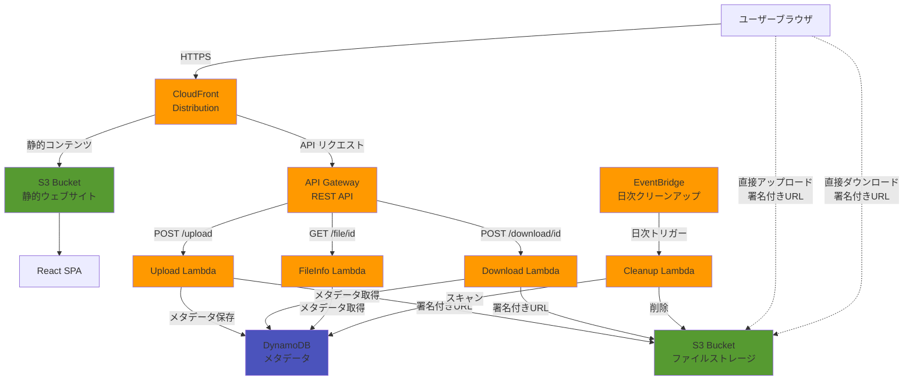
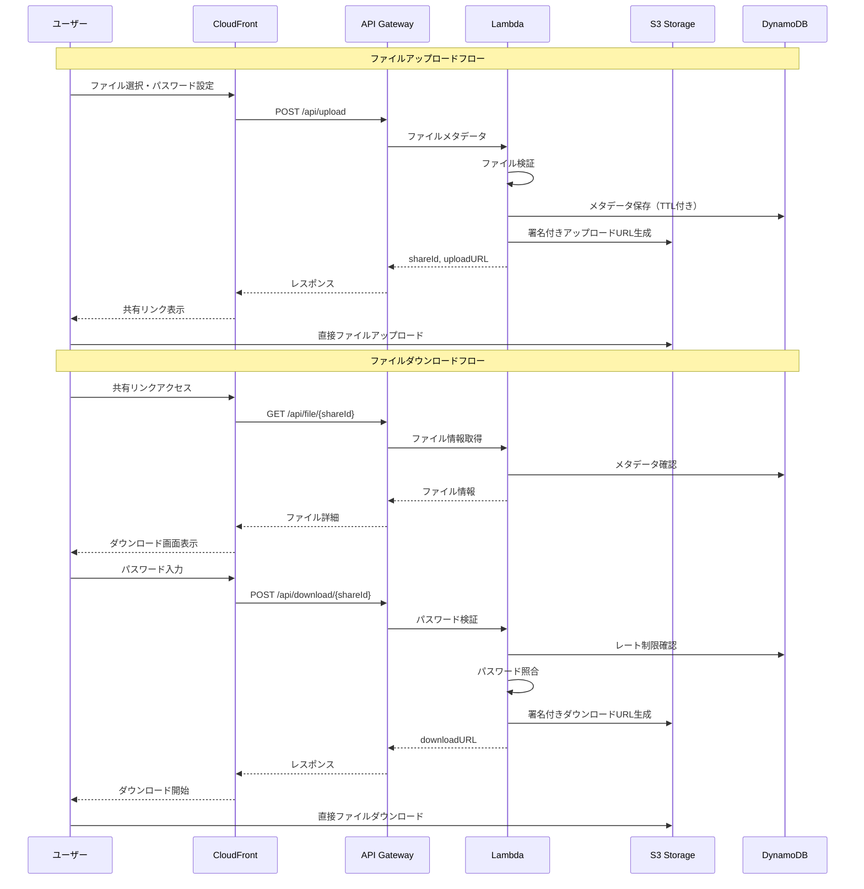

# fileLair - 匿名ファイル共有システム

## 概要

fileLair は、AWS サーバーレスアーキテクチャで構築されたセキュアな匿名ファイル共有プラットフォームです。ユーザーはファイルをアップロードし、オプションのパスワード保護付きの安全なリンクで共有できます。プライバシー保護のため、ファイルは 48 時間後に自動的に削除されます。

## アーキテクチャ

### システムアーキテクチャ図



### データフロー図



### 技術スタック

**フロントエンド:**

- React 18 + TypeScript
- Vite ビルドツール
- Tailwind CSS（スタイリング）
- React Router（ナビゲーション）
- Axios（API 通信）
- ダーク/ライトテーマ対応

**バックエンド:**

- AWS Lambda（Node.js 22.x ランタイム）
- AWS API Gateway
- AWS S3（ファイルストレージ）
- AWS DynamoDB（メタデータ）
- AWS CloudFront（CDN）
- bcrypt（パスワードハッシュ化）

**インフラストラクチャ:**

- AWS CDK（Infrastructure as Code）
- EventBridge（定期クリーンアップタスク）

## システムコンポーネント

### 1. ファイルアップロードシステム

**機能:**

- 署名付き URL を使用したブラウザから S3 への直接アップロード
- ファイルサイズ制限: 100MB
- アップロード進捗のリアルタイム追跡
- 強度検証付きオプションパスワード保護
- サポートされるファイルタイプ:
  - ドキュメント: .txt, .pdf, .doc, .docx, .xls, .xlsx, .ppt, .pptx
  - 画像: .jpg, .jpeg, .png, .gif, .bmp, .svg
  - 音声: .mp3, .wav
  - 動画: .mp4, .avi, .mov
  - アーカイブ: .zip, .rar, .7z, .tar, .gz

**アップロードフロー:**

1. ユーザーが Web インターフェースでファイルを選択
2. フロントエンドがバックエンドに署名付き URL をリクエスト
3. バックエンドがファイルメタデータを検証し、S3 署名付き URL を生成
4. フロントエンドが署名付き URL を使用して S3 に直接アップロード
5. バックエンドが DynamoDB に 48 時間の TTL 付きでメタデータを保存
6. ユーザーが共有可能なリンクを受け取る

### 2. ファイルダウンロードシステム

**機能:**

- 署名付き S3 URL による安全なダウンロード
- 保護されたファイルのパスワード検証
- レート制限: ファイルごとに IP アドレスあたり 5 回の試行
- 失敗後 15 分間のロックアウト
- ダウンロード回数の追跡

**ダウンロードフロー:**

1. ユーザーが共有リンクにアクセス
2. バックエンドがファイルの存在と有効期限を確認
3. パスワード保護されたファイルの場合:
   - ユーザーがパスワードを入力
   - バックエンドが bcrypt ハッシュと照合
   - 失敗時にレート制限を適用
4. バックエンドが署名付きダウンロード URL を生成
5. ユーザーが S3 から直接ダウンロード

### 3. セキュリティ機能

**パスワード保護:**

- bcrypt ハッシュによるパスワード保存
- パスワード強度要件:
  - 最小 8 文字
  - 最大 128 文字
  - 大文字、小文字、数字、特殊文字のうち 3 種類を含む
  - 一般的なパターンの検出
  - 連続する同一文字は 3 文字まで
- リアルタイム強度表示（弱/中/強）

**レート制限:**

- ファイルごとに IP アドレスあたり 5 回のパスワード試行
- 1 時間のスライディングウィンドウ
- 最大試行回数後 15 分間のロックアウト
- CloudFront ヘッダー解析による IP ベースの追跡
- DynamoDB エラー時のフェイルクローズ方式

**インフラストラクチャセキュリティ:**

- 保管時暗号化付き S3 バケット
- ストレージバケットの全パブリックアクセスをブロック
- 特定オリジン用の CORS 設定
- CloudFront セキュリティヘッダー:
  - Strict-Transport-Security
  - X-Content-Type-Options
  - X-Frame-Options: DENY
  - Content-Security-Policy
  - Referrer-Policy
  - Permissions-Policy

### 4. データ管理

**ファイルライフサイクル:**

- ファイルは 48 時間後に期限切れ
- DynamoDB TTL がメタデータを自動削除
- 日次 Lambda クリーンアップジョブが孤立した S3 オブジェクトを削除
- 追加の安全策として S3 ライフサイクルポリシー（7 日）

**ストレージ構造:**

- S3 キー: `YYYY/MM/DD/{shareId}/{filename}`
- 効率的なクリーンアップのための日付ベースのプレフィックス
- 暗号的にランダムな共有 ID（crypto.randomBytes）

### 5. ユーザーインターフェース

**機能:**

- モバイルとデスクトップ対応のレスポンシブデザイン
- ダーク/ライトテーマトグル（システム設定検出）
- ドラッグ＆ドロップファイルアップロード
- パーセンテージ付きリアルタイムアップロード進捗
- 共有リンクのクリップボードへのコピー
- 視覚的フィードバック付きパスワード強度インジケーター
- ユーザーフレンドリーなエラーメッセージ
- ファイルタイプアイコンとサイズ表示
- 共有ファイルの残り時間表示

## API エンドポイント

### POST /api/upload

ファイルアップロード用の署名付き URL をリクエスト

```json
リクエスト:
{
  "fileName": "string",
  "fileSize": "number",
  "contentType": "string",
  "password": "string (オプション)"
}

レスポンス:
{
  "success": true,
  "shareId": "string",
  "shareUrl": "string",
  "uploadUrl": "string",
  "expiresAt": "ISO 8601日時",
  "fileName": "string",
  "fileSize": "number"
}
```

### GET /api/file/{shareId}

ダウンロードせずにファイル情報を取得

```json
レスポンス:
{
  "success": true,
  "fileName": "string",
  "fileSize": "number",
  "uploadedAt": "ISO 8601日時",
  "expiresAt": "ISO 8601日時",
  "isPasswordProtected": "boolean"
}
```

### POST /api/download/{shareId}

ファイルダウンロード用の署名付き URL を取得

```json
リクエスト:
{
  "password": "string (オプション)"
}

レスポンス:
{
  "success": true,
  "downloadUrl": "string",
  "fileName": "string",
  "fileSize": "number",
  "mimeType": "string"
}
```

## 開発

### 前提条件

- Node.js 22.17.1 以上
- 適切な認証情報で設定された AWS CLI
- グローバルにインストールされた AWS CDK CLI

### セットアップ

```bash
# 依存関係のインストール（ワークスペース使用）
npm install

# フロントエンド開発サーバーの実行
npm run frontend:dev

# フロントエンドのビルド
npm run frontend:build

# バックエンドのビルド
npm run backend:build

# インフラストラクチャのデプロイ
npm run infra:deploy
```

### プロジェクト構造

```
filelair/
├── frontend/              # Reactアプリケーション
│   ├── src/
│   │   ├── components/    # Reactコンポーネント
│   │   ├── contexts/      # Reactコンテキスト（テーマ）
│   │   ├── types/         # TypeScript型定義
│   │   └── utils/         # ユーティリティ関数
│   └── dist/             # ビルド済みフロントエンドアセット
├── backend/              # Lambda関数
│   └── src/
│        ├── handlers/     # Lambdaハンドラー
│        ├── types/        # TypeScript型定義
│        └── utils/        # 共有ユーティリティ
└── infrastructure/       # AWS CDKコード
    └── lib/              # CDKスタック定義
```

## デプロイメント

AWS CDK を使用してデプロイ:

1. **S3 バケット:**

   - 暗号化付きファイルストレージバケット（全パブリックアクセスブロック）
   - フロントエンド用静的ウェブサイトホスティングバケット

2. **Lambda 関数:**

   - アップロードハンドラー（5 分タイムアウト、512MB メモリ）
   - ダウンロードハンドラー（1 分タイムアウト）
   - ファイル情報ハンドラー（30 秒タイムアウト）
   - クリーンアップハンドラー（15 分タイムアウト、1024MB メモリ、日次スケジュール）

3. **API Gateway:**

   - CORS 対応の REST API
   - Lambda プロキシ統合
   - バイナリメディアタイプサポート

4. **CloudFront ディストリビューション:**

   - S3 からフロントエンドを配信
   - API Gateway への API リクエストをプロキシ
   - セキュリティヘッダー適用
   - HTTPS リダイレクト強制

5. **DynamoDB テーブル:**
   - シングルテーブル設計
   - 自動クリーンアップ用 TTL 有効化
   - ペイパーリクエスト課金

## エラー処理

API が返すエラーコード:

- `FILE_TOO_LARGE` - ファイルが 100MB 制限を超過
- `INVALID_FILE_TYPE` - 許可されていないファイルタイプ
- `FILE_NOT_FOUND` - ファイルが存在しないか期限切れ
- `INVALID_PASSWORD` - パスワードが正しくない
- `UPLOAD_FAILED` - アップロードプロセスが失敗
- `STORAGE_ERROR` - S3/DynamoDB 操作が失敗
- `VALIDATION_ERROR` - 無効なリクエストパラメータ

## モニタリング

- 全 Lambda 関数の CloudWatch ログ
- 機密データをフィルタリングするセキュアロギングユーティリティ
- API Gateway アクセスログ
- S3 アクセスログ（オプション）
- DynamoDB メトリクス
- Lambda 関数メトリクス（実行時間、エラー、スロットル）

## コスト考慮事項

- DynamoDB のペイパーリクエスト価格
- S3 ストレージと転送コスト
- Lambda 呼び出しコスト（1ms 単位で課金）
- CloudFront データ転送
- API Gateway リクエストコスト
- EventBridge スケジュールルール

## 環境変数

Lambda 関数で使用:

- `S3_BUCKET_NAME` - ファイルストレージ用 S3 バケット
- `DYNAMODB_TABLE_NAME` - DynamoDB テーブル名

## セキュリティベストプラクティス

1. 全ファイルアクセスに有効な共有 ID が必要
2. ディレクトリリスティング不可
3. 署名付き URL は短時間で期限切れ
4. パスワード試行失敗にレート制限
5. 全データ転送時暗号化（HTTPS）
6. S3 データ保管時暗号化
7. ユーザー追跡や分析なし
8. 自動クリーンアップによるデータプライバシー保証

## 制限事項

- 最大ファイルサイズ: 100MB
- ファイルは 48 時間後に期限切れ
- ファイルプレビュー機能なし
- 一度に 1 ファイルのみアップロード
- 再開可能アップロードなし

## 将来の拡張案

改善の可能性:

- 複数ファイルのアップロード/ダウンロード
- 複数ファイルの Zip ダウンロード
- ファイルダウンロード時のメール通知
- カスタム有効期限（1-7 日）
- クライアントサイド暗号化オプション
- ウイルススキャン統合
- ダウンロード回数制限
- 画像/PDF のファイルプレビュー
- Progressive Web App 対応
- 帯域幅制限オプション
