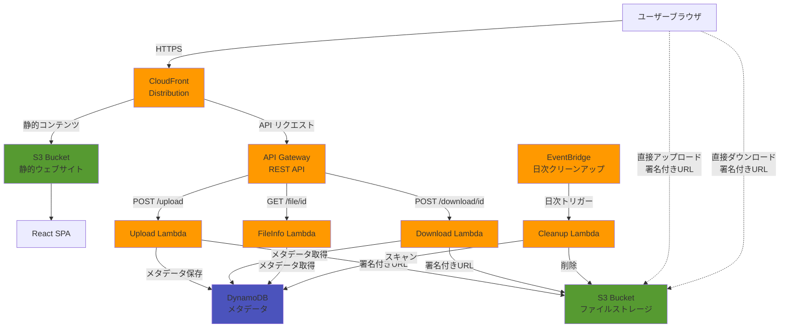

# FileLair - セキュアな匿名ファイル共有システム

## 概要

FileLair は、AWS サーバーレスアーキテクチャで構築されたセキュアな匿名ファイル共有プラットフォームです。ユーザーはファイルをアップロードし、オプションのパスワード保護付きの安全なリンクで共有できます。プライバシー保護のため、ファイルは 48 時間後に自動的に削除されます。

### 主な特徴

- 🔒 **完全匿名** - ユーザー登録・ログイン不要
- 🛡️ **エンドツーエンド暗号化** - 転送時・保管時の完全暗号化
- 🔐 **パスワード保護** - リアルタイム強度表示付きの強力なパスワード保護
- ⏰ **自動削除** - 48 時間後に自動的にファイルとメタデータを削除
- 🚀 **高速転送** - S3 への直接アップロード/ダウンロード
- 📱 **レスポンシブデザイン** - モバイル・デスクトップ対応
- 🌙 **ダークモード** - システム設定連動のテーマ切り替え
- 📊 **リアルタイム進捗** - アップロード/ダウンロードの進捗表示

## アーキテクチャ

### システムアーキテクチャ図



### 技術スタック

**フロントエンド:**

- React 18 + TypeScript
- Vite ビルドツール
- Tailwind CSS（レスポンシブデザイン）
- React Router（ルーティング）
- Axios（API 通信）
- リアルタイム進捗トラッキング

**バックエンド:**

- AWS Lambda（Node.js 22.x）
- AWS API Gateway（REST API）
- AWS S3（ファイルストレージ、SSE-S3 暗号化）
- AWS DynamoDB（メタデータストレージ）
- AWS CloudFront（CDN 配信）
- bcrypt（パスワードハッシュ化）

**インフラストラクチャ:**

- AWS CDK v2（Infrastructure as Code）
- EventBridge（定期クリーンアップ）
- GitHub Actions（CI/CD パイプライン）
- AWS OIDC（セキュアなデプロイメント認証）

## セキュリティ仕様

### 1. パスワード保護システム

**パスワード要件:**

- 長さ: 8 文字以上 128 文字以下
- 複雑性: 以下の 4 種類から 3 種類以上を含む
  - 大文字（A-Z）
  - 小文字（a-z）
  - 数字（0-9）
  - 特殊文字（!@#$%^&\*()\_+-=[]{}|;:,.<>?）
- 制限事項:
  - 同一文字の連続は 3 文字まで
  - キーボードパターン（qwerty、12345 など）を禁止
  - 一般的な単語（password、admin など）を禁止

**パスワード強度インジケーター:**

- **弱（赤）**: 最小要件のみ満たす
- **中（黄）**: 10 文字以上、3 種類の文字種
- **強（緑）**: 12 文字以上、4 種類の文字種、パターンなし

**ハッシュ化:**

- bcrypt アルゴリズム使用（ソルトラウンド: 10）
- ハッシュ結果は 60 文字の安全な形式で保存

### 2. レート制限とブルートフォース対策

**制限メカニズム:**

- ファイルごと、IP アドレスごとに最大 5 回の試行を許可
- 1 時間のスライディングウィンドウで試行回数を追跡
- 制限超過後は 15 分間のロックアウト
- API Gateway 検証済み IP アドレスを使用（なりすまし防止）

**エラー時の動作:**

- DynamoDB エラー時はフェイルクローズ（アクセス拒否）
- 残り試行回数をユーザーに表示
- ロックアウト時は解除時刻を表示

### 3. ファイル検証とセキュリティ

**ファイルタイプ検証:**

- 許可される拡張子:
  - ドキュメント: .txt, .pdf, .doc, .docx, .xls, .xlsx, .ppt, .pptx
  - 画像: .jpg, .jpeg, .png, .gif, .bmp, .svg, .webp
  - 音声: .mp3, .wav, .ogg
  - 動画: .mp4, .avi, .mov, .mkv
  - アーカイブ: .zip, .rar, .7z, .tar, .gz

**多重拡張子検出:**

- 実行可能ファイルの偽装を防止（例: file.pdf.exe をブロック）
- 危険な拡張子リスト: .exe, .bat, .cmd, .com, .pif, .scr, .vbs, .js, .jar, .app

**MIME タイプ検証:**

- 拡張子と MIME タイプの整合性チェック
- 既知の拡張子に対する期待される MIME タイプのマッピング
- application/octet-stream は汎用フォールバックとして許可

**ファイル名サニタイゼーション:**

- 英数字、ピリオド、ハイフン、アンダースコアのみ許可
- パストラバーサル攻撃を防止
- 特殊文字は自動的にアンダースコアに置換

### 4. ネットワークセキュリティ

**HTTPS 強制:**

- CloudFront で HTTP→HTTPS の自動リダイレクト
- TLS 1.2 以上のみサポート
- 強力な暗号スイートの使用

**セキュリティヘッダー:**

- `Strict-Transport-Security`: HSTS 有効化
- `X-Content-Type-Options`: MIME スニッフィング防止
- `X-Frame-Options`: クリックジャッキング防止
- `X-XSS-Protection`: XSS 攻撃の軽減
- `Content-Security-Policy`: 厳格なコンテンツ実行ポリシー
- `Referrer-Policy`: リファラー情報の制限
- `Permissions-Policy`: ブラウザ機能の制限

**CORS 設定:**

- 本番環境の CloudFront ドメインのみ許可
- 認証情報の送信を制限
- プリフライトリクエストの適切な処理

### 5. データ保護とプライバシー

**暗号化:**

- **転送時**: TLS 1.2+による暗号化
- **保管時**:
  - S3: SSE-S3（AES-256）自動暗号化
  - DynamoDB: AWS 管理キーによる暗号化

**自動削除メカニズム:**

- DynamoDB TTL: 48 時間後に自動削除
- 日次 EventBridge トリガーによる S3 クリーンアップ
- S3 ライフサイクルルール: 7 日後の削除（フェイルセーフ）

**ShareID 生成:**

- 暗号学的に安全な 16 バイトのランダム値
- 32 文字の 16 進数文字列（128 ビットのエントロピー）
- 推測困難性: 2^128 の可能な組み合わせ

**S3 キー構造:**

- 日付ベースの整理で効率的なクリーンアップ
- パストラバーサル攻撃の防止

### 6. 認証と認可

**署名付き URL:**

- アップロード用: 1 時間の有効期限
- ダウンロード用: 1 時間の有効期限
- ファイルごとに独立したアクセス制御
- 直接的な S3 アクセスで高速転送を実現

**アクセス制御:**

- ShareID なしではファイルにアクセス不可
- ディレクトリリスティング不可
- S3 バケットは完全にパブリックアクセスをブロック

### 7. ログとモニタリング

**ログポリシー:**

- センシティブ情報の自動マスキング
  - 完全な ShareID（最初の 8 文字のみ表示）
  - プリサインド URL
  - ファイル名
  - IP アドレス（レート制限後は破棄）
  - パスワード（ハッシュ化前後とも）
- 本番環境では最小限のログ出力
- 開発環境でのみ詳細ログを有効化

**エラーハンドリング:**

- ユーザーフレンドリーなエラーメッセージ
- 内部エラーの詳細は露出しない
- ネットワークエラーの検出と再試行ガイダンス

## ユーザー操作フロー

### ファイルアップロード

1. **ファイル選択**

   - ドラッグ&ドロップまたはクリックで選択
   - 最大 100MB、許可されたファイルタイプのみ
   - ファイル情報の即時表示

2. **パスワード設定（オプション）**

   - チェックボックスでパスワード保護を有効化
   - パスワード入力時にリアルタイム強度表示
   - 確認用パスワード入力で誤入力防止
   - パスワード表示/非表示トグル

3. **アップロード実行**

   - プログレスバーでリアルタイム進捗表示
   - ネットワークエラー時の自動リトライ
   - キャンセル可能

4. **共有リンク生成**
   - ワンクリックでクリップボードにコピー
   - 有効期限の表示

### ファイルダウンロード

1. **共有リンクアクセス**

   - ファイル名、サイズ、アップロード日時の表示
   - 有効期限までの残り時間表示
   - パスワード保護状態の表示

2. **パスワード入力（必要な場合）**

   - 残り試行回数の表示
   - パスワード表示/非表示トグル
   - エラー時の明確なフィードバック

3. **ダウンロード実行**
   - ワンクリックでダウンロード開始
   - ブラウザの標準ダウンロード機能を使用
   - 大容量ファイルの進捗表示

## API エンドポイント

### POST /api/upload

署名付きアップロード URL の生成とファイルメタデータの保存

**リクエスト:**

- `fileName`: ファイル名
- `fileSize`: ファイルサイズ（バイト）
- `contentType`: MIME タイプ
- `password`: オプションのパスワード

**レスポンス:**

- `shareId`: 一意の共有 ID
- `shareUrl`: 共有用 URL
- `uploadUrl`: S3 署名付きアップロード URL
- `expiresAt`: 有効期限
- ファイルメタデータ

### GET /api/file/{shareId}

ファイル情報の取得（ダウンロードなし）

**レスポンス:**

- ファイル名、サイズ
- アップロード日時、有効期限
- パスワード保護の有無
- 存在確認とアクセス可否

### POST /api/download/{shareId}

署名付きダウンロード URL の生成

**リクエスト:**

- `password`: パスワード（保護されている場合）

**レスポンス:**

- `downloadUrl`: S3 署名付きダウンロード URL
- ファイルメタデータ
- 適切な Content-Disposition ヘッダー

## エラーコード

- `FILE_TOO_LARGE`: ファイルサイズが 100MB を超過
- `INVALID_FILE_TYPE`: 許可されていないファイルタイプ
- `FILE_NOT_FOUND`: ファイルが存在しないか期限切れ
- `INVALID_PASSWORD`: パスワードが正しくない
- `RATE_LIMITED`: レート制限に到達
- `UPLOAD_FAILED`: アップロードプロセスの失敗
- `STORAGE_ERROR`: S3/DynamoDB 操作の失敗
- `VALIDATION_ERROR`: 無効なリクエストパラメータ

## 開発

### 前提条件

- Node.js 22.17.1 以上
- AWS CLI（適切な認証情報で設定済み）
- AWS CDK CLI v2

### セットアップ

```bash
# リポジトリのクローン
git clone https://github.com/hanabiscus/file-sharing.git
cd file-sharing

# 依存関係のインストール
npm install

# フロントエンド開発サーバー
npm run frontend:dev

# ビルド
npm run frontend:build
npm run backend:build

# インフラストラクチャのデプロイ
npm run infra:deploy
```

### プロジェクト構造

```
file-sharing/
├── frontend/                # Reactアプリケーション
│   ├── src/
│   │   ├── components/    # UIコンポーネント
│   │   ├── contexts/      # React Context（テーマ管理）
│   │   ├── types/         # TypeScript型定義
│   │   └── utils/         # ユーティリティ関数
│   └── dist/               # ビルド成果物
├── backend/                 # Lambda関数
│   └── src/
│       ├── handlers/     # APIハンドラー
│       ├── types/        # 共通型定義
│       └── utils/        # ユーティリティ（検証、S3操作等）
├── infrastructure/        # AWS CDK
│   └── lib/              # スタック定義
└── .github/
    └── workflows/       # GitHub Actions CI/CD
```

## デプロイメント

### GitHub Actions CI/CD

1. **初回セットアップ**

   ```bash
   cd infrastructure
   npm run deploy  # OIDCプロバイダーとIAMロール作成
   ```

2. **GitHub Secrets 設定**

   - `AWS_ROLE_ARN`: デプロイ出力から取得

3. **自動デプロイ**
   - main ブランチへのプッシュ: 自動デプロイ

### インフラストラクチャ

**主要リソース:**

- S3 バケット（ファイルストレージ、静的ホスティング）
- Lambda 関数（アップロード、ダウンロード、情報取得、クリーンアップ）
- API Gateway（REST API、CORS 対応）
- CloudFront（CDN 配信、セキュリティヘッダー）
- DynamoDB（メタデータ、TTL 有効）
- EventBridge（日次クリーンアップ）

**IAM ポリシー:**

- 最小権限の原則
- サービスごとの限定的なアクセス
- GitHub Actions 用の安全な OIDC 認証

## 制限事項

- 最大ファイルサイズ: 100MB
- ファイル有効期限: 48 時間（変更不可）
- 一度に 1 ファイルのみアップロード
- ファイルプレビュー機能なし
- 再開可能アップロードなし
- ダウンロード回数制限なし（レート制限のみ）

### 開発ガイドライン

- TypeScript の型安全性を維持
- 既存のコードスタイルに従う
- セキュリティを最優先に考慮

## セキュリティ報告

セキュリティ上の問題を発見した場合は、公開せずに責任ある開示をお願いします。
