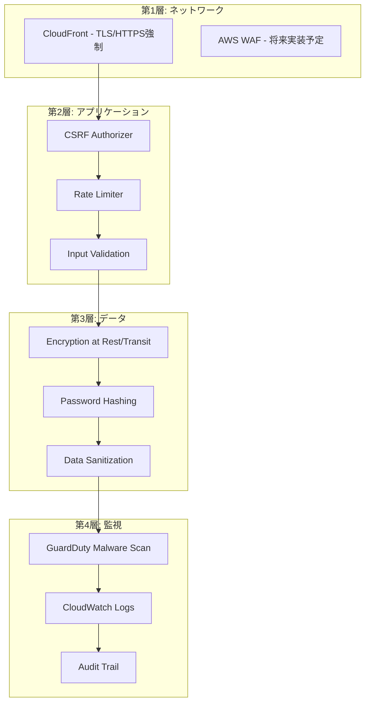
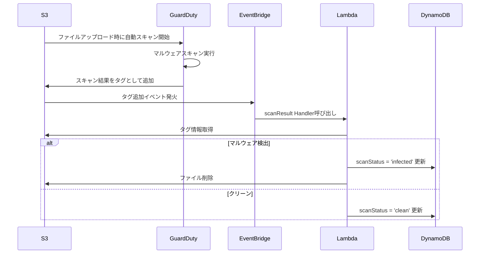

# FileLair セキュリティ対策実装ドキュメント

## 1. はじめに

本ドキュメントは、FileLairシステムに実装されているセキュリティ対策について、システム開発者向けに詳細を説明します。OWASP Top 10などの主要な脅威に対する防御策を中心に、実装の詳細と設定方法を記載しています。

## 2. セキュリティアーキテクチャ概要

### 2.1 多層防御（Defense in Depth）

FileLairは以下の層でセキュリティを実装しています：



### 2.2 ゼロトラストモデル

- すべてのリクエストを検証
- 最小権限の原則
- 継続的な監視と検証

## 3. 実装されているセキュリティ対策

### 3.1 CSRF（Cross-Site Request Forgery）保護

#### 実装方式: Double Submit Cookie Pattern

**実装ファイル**: 
- `backend/src/utils/csrf.ts`
- `backend/src/handlers/csrfAuthorizer.ts`
- `backend/src/middleware/csrfMiddleware.ts`

**技術仕様**:

```typescript
// トークン生成
export function generateCSRFToken(): string {
  return crypto.randomBytes(32).toString('hex');
}

// 暗号化設定
const algorithm = 'aes-256-gcm';
const ivLength = 16;
const tagLength = 16;
const saltLength = 64;

// Cookie設定
const cookieOptions = {
  httpOnly: true,
  secure: true,
  sameSite: 'Strict',
  maxAge: 24 * 60 * 60 * 1000, // 24時間
  path: '/'
};
```

**実装の流れ**:

1. **トークン初期化** (`GET /api/init-csrf`):
   ```typescript
   // 1. 32バイトのランダムトークン生成
   const token = generateCSRFToken();
   
   // 2. AES-256-GCMで暗号化
   const encryptedData = encryptToken(token);
   
   // 3. HttpOnly Cookieに保存
   response.headers['Set-Cookie'] = `csrf-token=${encryptedData}; ${cookieOptions}`;
   
   // 4. 平文トークンをクライアントに返却
   return { token };
   ```

2. **トークン検証** (API Gateway Custom Authorizer):
   ```typescript
   // 1. CookieとHeaderからトークンを取得
   const cookieToken = decryptToken(event.headers.Cookie);
   const headerToken = event.headers['X-CSRF-Token'];
   
   // 2. タイミングセーフな比較
   const isValid = crypto.timingSafeEqual(
     Buffer.from(cookieToken),
     Buffer.from(headerToken)
   );
   ```

**セキュリティ強度**:
- 暗号化により中間者攻撃を防止
- SameSite=Strictでクロスサイトリクエストを制限
- タイミング攻撃に対する防御

### 3.2 レート制限（Rate Limiting）

#### パスワード試行制限

**実装ファイル**: `backend/src/utils/rateLimiter.ts`

**設定値**:
```typescript
const RATE_LIMIT_CONFIG = {
  maxAttempts: 5,           // 最大試行回数
  windowMs: 60 * 60 * 1000, // 1時間のウィンドウ
  blockDurationMs: 15 * 60 * 1000, // 15分間のブロック
};
```

**実装詳細**:

```typescript
export async function checkPasswordRateLimit(
  shareId: string,
  ipAddress: string
): Promise<RateLimitResult> {
  const id = `${shareId}#${ipAddress}`;
  
  try {
    // DynamoDBから現在の試行状態を取得
    const record = await getRateLimitRecord(id);
    
    // ロックアウト中かチェック
    if (record?.lockedUntil && Date.now() < record.lockedUntil) {
      return {
        allowed: false,
        remainingAttempts: 0,
        resetTime: new Date(record.lockedUntil),
      };
    }
    
    // 試行回数チェック
    const attempts = record?.attempts || 0;
    if (attempts >= RATE_LIMIT_CONFIG.maxAttempts) {
      // ロックアウト設定
      await setLockout(id);
      return {
        allowed: false,
        remainingAttempts: 0,
        resetTime: new Date(Date.now() + RATE_LIMIT_CONFIG.blockDurationMs),
      };
    }
    
    return {
      allowed: true,
      remainingAttempts: RATE_LIMIT_CONFIG.maxAttempts - attempts,
    };
  } catch (error) {
    // フェイルクローズド：エラー時はアクセス拒否
    return {
      allowed: false,
      remainingAttempts: 0,
      error: 'Rate limit check failed',
    };
  }
}
```

**DynamoDBスキーマ**:
```typescript
interface RateLimitRecord {
  id: string;         // "{shareId}#{ipAddress}"
  attempts: number;   // 試行回数
  windowStart: number; // ウィンドウ開始時刻
  lockedUntil?: number; // ロックアウト終了時刻
  ttl: number;        // 自動削除用TTL
}
```

### 3.3 入力検証（Input Validation）

#### ファイル検証

**実装ファイル**: `backend/src/utils/fileValidation.ts`

**検証項目**:

1. **ファイルサイズ検証**:
   ```typescript
   if (size > UPLOAD_CONFIG.maxFileSize) {
     throw new ValidationError('FILE_TOO_LARGE', 
       `File size ${actualSizeMB}MB exceeds maximum ${maxSizeMB}MB`);
   }
   ```

2. **拡張子検証（多重拡張子攻撃対策）**:
   ```typescript
   // malicious.pdf.exeのような攻撃を検出
   const dangerousExtensions = ['.exe', '.bat', '.cmd', '.com', '.pif', '.scr'];
   const extensions = filename.split('.').slice(1);
   
   if (extensions.some(ext => dangerousExtensions.includes(`.${ext}`))) {
     throw new ValidationError('INVALID_FILE_TYPE',
       'Files with executable extensions are not allowed');
   }
   ```

3. **MIMEタイプ整合性チェック**:
   ```typescript
   // 拡張子とMIMEタイプの整合性を検証
   const expectedTypes = extensionToMimeTypes[extension];
   if (mimeType && !expectedTypes.includes(mimeType)) {
     throw new ValidationError('INVALID_FILE_TYPE',
       `MIME type ${mimeType} does not match extension ${extension}`);
   }
   ```

4. **パストラバーサル攻撃防止**:
   ```typescript
   if (filename.includes('../') || filename.includes('..\\')) {
     throw new ValidationError('INVALID_FILE_TYPE',
       'Filename contains path traversal characters');
   }
   ```

#### パスワード検証

**実装ファイル**: `backend/src/utils/passwordValidator.ts`

**検証ルール**:

```typescript
export function validatePasswordStrength(password: string): PasswordValidation {
  const errors: string[] = [];
  let score = 0;

  // 長さチェック
  if (password.length < 8) {
    errors.push('Password must be at least 8 characters long');
  } else if (password.length >= 12) {
    score += 2;
  }

  // 文字種チェック
  const hasUpperCase = /[A-Z]/.test(password);
  const hasLowerCase = /[a-z]/.test(password);
  const hasNumbers = /[0-9]/.test(password);
  const hasSpecialChars = /[!@#$%^&*()_+\-=[\]{}|;:,.<>?]/.test(password);
  
  const typeCount = [hasUpperCase, hasLowerCase, hasNumbers, hasSpecialChars]
    .filter(Boolean).length;
  
  if (typeCount < 3) {
    errors.push('Password must contain at least 3 different character types');
  }

  // 一般的なパスワードチェック
  const commonPasswords = ['password', 'admin', 'qwerty', '123456'];
  if (commonPasswords.some(common => 
    password.toLowerCase().includes(common))) {
    errors.push('Password contains common patterns');
  }

  // 連続文字チェック
  if (/(.)\1{3,}/.test(password)) {
    errors.push('Password contains too many repeated characters');
  }

  return {
    isValid: errors.length === 0,
    errors,
    strength: score >= 4 ? 'strong' : score >= 2 ? 'medium' : 'weak'
  };
}
```

### 3.4 暗号化とハッシュ化

#### データ暗号化

**転送時暗号化**:
- CloudFront: TLS 1.2以上を強制
- API Gateway: HTTPS Only

**保存時暗号化**:
- S3: SSE-S3 (AES-256)
- DynamoDB: AWS管理キーによる暗号化

#### パスワードハッシュ化

**実装ファイル**: `backend/src/utils/crypto.ts`

```typescript
export async function hashPassword(password: string): Promise<string> {
  // bcryptは72バイトを超えるパスワードを切り捨てるため制限
  if (password.length > 128) {
    throw new Error('Password too long');
  }
  
  const saltRounds = 10;
  return bcrypt.hash(password, saltRounds);
}

export async function verifyPassword(
  password: string, 
  hash: string
): Promise<boolean> {
  return bcrypt.compare(password, hash);
}
```

#### ShareID生成（暗号学的に安全な乱数）

```typescript
export function generateShareId(): string {
  // 24バイト（192ビット）のエントロピー
  const randomBytes = crypto.randomBytes(24);
  
  // タイムスタンプを組み込んで一意性を強化
  const timestamp = Buffer.allocUnsafe(8);
  timestamp.writeBigInt64BE(BigInt(Date.now()), 0);
  
  const combined = Buffer.concat([randomBytes, timestamp]);
  
  // SHA-256でハッシュ化して均一分布を保証
  const hash = crypto.createHash('sha256').update(combined).digest();
  
  // base64urlエンコーディングで32文字のIDに
  return hash.toString('base64url').substring(0, 32);
}
```

### 3.5 セキュリティヘッダー

**実装ファイル**: `backend/src/utils/security.ts`

```typescript
export function getSecurityHeaders(): Record<string, string> {
  return {
    'X-Content-Type-Options': 'nosniff',
    'X-Frame-Options': 'DENY',
    'X-XSS-Protection': '1; mode=block',
    'Referrer-Policy': 'strict-origin-when-cross-origin',
    'Strict-Transport-Security': 'max-age=31536000; includeSubDomains',
    'Content-Security-Policy': [
      "default-src 'self'",
      "script-src 'self' 'unsafe-inline'",
      "style-src 'self' 'unsafe-inline'",
      "img-src 'self' data: https:",
      "font-src 'self'",
      "connect-src 'self' https://*.amazonaws.com",
      "frame-ancestors 'none'",
      "base-uri 'self'",
      "form-action 'self'"
    ].join('; '),
    'Permissions-Policy': 'geolocation=(), microphone=(), camera=()',
    'Cache-Control': 'no-store, no-cache, must-revalidate, proxy-revalidate',
    'Pragma': 'no-cache',
    'Expires': '0'
  };
}
```

### 3.6 CORS（Cross-Origin Resource Sharing）設定

```typescript
export function getCorsHeaders(origin: string | undefined): Record<string, string> {
  const allowedOrigins = [
    process.env.FRONTEND_URL,
    'https://dk7lvukl3cd5w.cloudfront.net'
  ];
  
  // CloudFrontのパターンマッチング
  const isCloudFrontOrigin = origin?.match(
    /^https:\/\/d[a-z0-9]{13}\.cloudfront\.net$/
  );
  
  if (origin && (allowedOrigins.includes(origin) || isCloudFrontOrigin)) {
    return {
      'Access-Control-Allow-Origin': origin,
      'Access-Control-Allow-Credentials': 'true',
      'Access-Control-Allow-Methods': 'GET, POST, OPTIONS',
      'Access-Control-Allow-Headers': 'Content-Type, X-CSRF-Token',
      'Access-Control-Max-Age': '86400'
    };
  }
  
  // デフォルト：CORSを許可しない
  return {};
}
```

### 3.7 マルウェア保護

#### Amazon GuardDuty Malware Protection

**実装ファイル**: `backend/src/handlers/scanResult.ts`

**処理フロー**:



**スキャン結果の処理**:

```typescript
const scanStatusTag = tags.find(
  tag => tag.Key === 'GuardDutyMalwareScanStatus'
);

if (scanStatusTag.Value === 'NO_THREATS_FOUND') {
  // ファイルはクリーン
  await updateFileRecord(shareId, {
    scanStatus: 'clean',
    scanDate: Date.now()
  });
} else {
  // マルウェア検出または他のエラー
  await updateFileRecord(shareId, {
    scanStatus: 'infected',
    scanDate: Date.now(),
    scanResult: JSON.stringify({ status: scanStatusTag.Value })
  });
  
  // 感染ファイルを即座に削除
  await s3Client.send(new DeleteObjectCommand({
    Bucket: S3_BUCKET_NAME,
    Key: objectKey
  }));
}
```

### 3.8 ログとモニタリング

#### セキュアなログ記録

```typescript
export function sanitizeForLog(data: any): any {
  const sensitiveKeys = ['password', 'passwordHash', 'token', 'csrf'];
  
  if (typeof data !== 'object' || data === null) {
    return data;
  }
  
  const sanitized = { ...data };
  
  for (const key of Object.keys(sanitized)) {
    if (sensitiveKeys.some(sensitive => 
      key.toLowerCase().includes(sensitive))) {
      sanitized[key] = '[REDACTED]';
    } else if (typeof sanitized[key] === 'object') {
      sanitized[key] = sanitizeForLog(sanitized[key]);
    }
  }
  
  return sanitized;
}

// 使用例
console.log('Request:', sanitizeForLog(event));
```

## 4. IAMロールとポリシー

### 4.1 最小権限の原則

各Lambda関数は必要最小限の権限のみを持ちます：

```typescript
// Upload Lambda
uploadFunction.addToRolePolicy(new iam.PolicyStatement({
  actions: [
    's3:PutObject',
    's3:PutObjectTagging',
    'dynamodb:PutItem'
  ],
  resources: [
    filesBucket.bucketArn,
    `${filesBucket.bucketArn}/*`,
    dynamoTable.tableArn
  ]
}));

// Download Lambda（読み取りのみ）
downloadFunction.addToRolePolicy(new iam.PolicyStatement({
  actions: [
    's3:GetObject',
    'dynamodb:GetItem',
    'dynamodb:UpdateItem' // ダウンロードカウントのみ
  ],
  resources: [
    filesBucket.bucketArn,
    `${filesBucket.bucketArn}/*`,
    dynamoTable.tableArn
  ]
}));
```

### 4.2 クロスアカウントアクセスの防止

```typescript
const bucketPolicy = new iam.PolicyStatement({
  effect: iam.Effect.DENY,
  principals: [new iam.AnyPrincipal()],
  actions: ['s3:*'],
  resources: [
    bucket.bucketArn,
    `${bucket.bucketArn}/*`
  ],
  conditions: {
    StringNotEquals: {
      'AWS:SourceAccount': this.account
    }
  }
});
```

## 5. 環境変数の管理

### 5.1 機密情報の保護

```typescript
// Systems Manager Parameter Storeから取得
const csrfEncryptionKey = ssm.StringParameter.fromSecureStringParameterAttributes(
  this,
  'CSRFEncryptionKey',
  {
    parameterName: '/filelair/csrf-encryption-key',
    version: 1
  }
);

// Lambda環境変数として設定
uploadFunction.addEnvironment(
  'CSRF_ENCRYPTION_KEY',
  csrfEncryptionKey.stringValue
);
```

## 6. セキュリティテストのガイドライン

### 6.1 ペネトレーションテスト項目

1. **CSRF攻撃**:
   - トークンなしのリクエスト
   - 無効なトークンでのリクエスト
   - トークンの再利用

2. **ブルートフォース攻撃**:
   - パスワード総当たり
   - レート制限の回避試行

3. **ファイルアップロード攻撃**:
   - 悪意のある拡張子
   - 巨大ファイル
   - パストラバーサル

4. **XSS攻撃**:
   - ファイル名へのスクリプト埋め込み
   - エラーメッセージの悪用

### 6.2 セキュリティ監査チェックリスト

- [ ] すべてのエンドポイントでHTTPS強制
- [ ] CSRFトークンの有効性確認
- [ ] レート制限の動作確認
- [ ] パスワードハッシュの強度確認
- [ ] ログに機密情報が含まれていないか
- [ ] IAMロールの権限が最小限か
- [ ] セキュリティヘッダーが正しく設定されているか

## 7. インシデント対応

### 7.1 セキュリティインシデント発生時の対応

1. **検出**:
   - CloudWatch Alarmsによる異常検知
   - GuardDutyによるマルウェア検出

2. **封じ込め**:
   - 影響を受けたリソースの隔離
   - 必要に応じてサービスの一時停止

3. **根絶**:
   - 悪意のあるファイルの削除
   - 侵害されたアクセスの無効化

4. **復旧**:
   - クリーンな状態からのサービス再開
   - 追加のセキュリティ対策の実装

5. **事後分析**:
   - ログの詳細分析
   - 再発防止策の策定

## 8. セキュリティのベストプラクティス

### 8.1 開発時の注意事項

1. **依存関係の管理**:
   ```bash
   # 定期的な脆弱性チェック
   npm audit
   npm audit fix
   ```

2. **コードレビュー**:
   - セキュリティ観点でのレビュー必須
   - 機密情報のハードコーディング禁止

3. **テスト**:
   - セキュリティテストの自動化
   - ペネトレーションテストの定期実施

### 8.2 運用時の注意事項

1. **定期的な更新**:
   - Lambda ランタイムの更新
   - 依存パッケージの更新

2. **監視強化**:
   - 異常なアクセスパターンの検知
   - セキュリティメトリクスの追跡

3. **アクセス管理**:
   - AWS IAMの定期的な棚卸し
   - 不要なアクセス権限の削除

## 9. まとめ

FileLairは、複数層のセキュリティ対策により、安全なファイル共有環境を実現しています。本ドキュメントに記載された実装を維持・改善することで、継続的にセキュアなサービス提供が可能となります。

開発者は、新機能追加時には必ず本ドキュメントを参照し、既存のセキュリティ対策を損なわないよう注意してください。