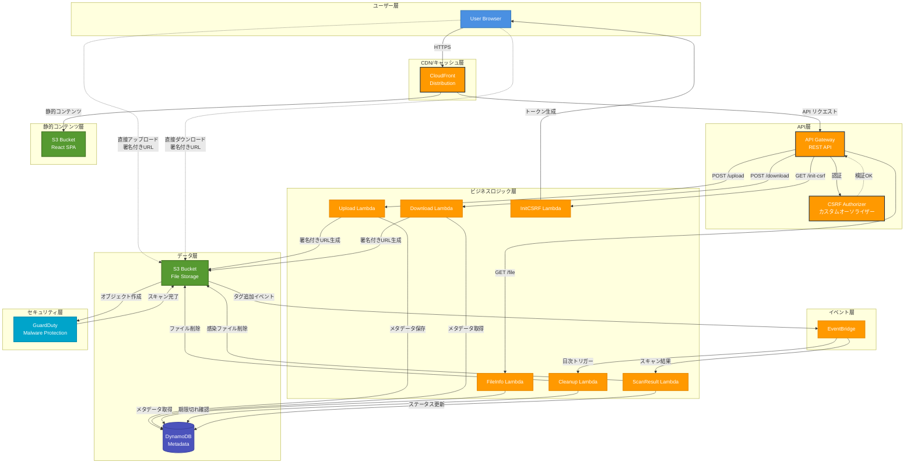
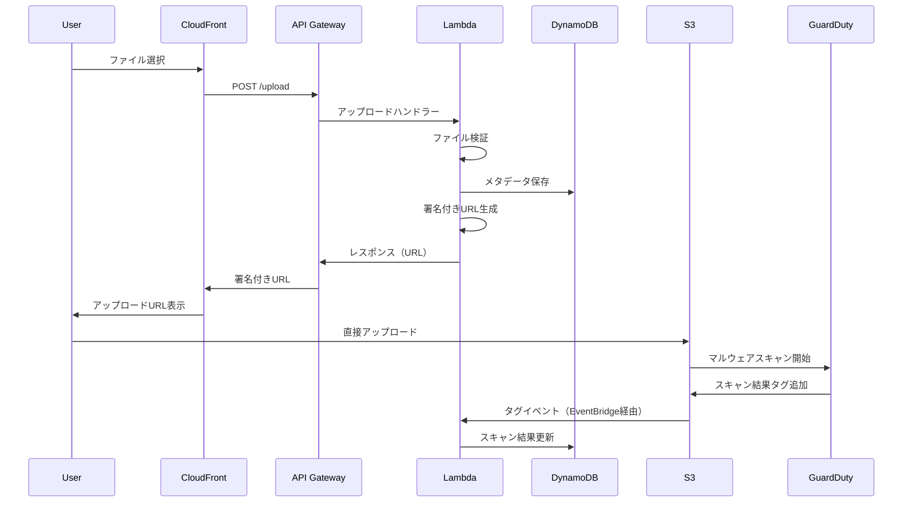
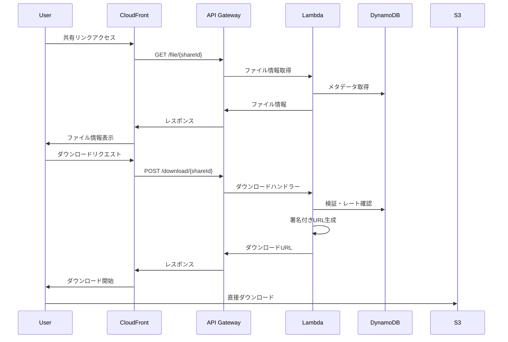

# FileLair システム全体設計書

## 1. システム概要

### 1.1 目的
FileLairは、AWSサーバーレスアーキテクチャを基盤とした、セキュアで匿名性の高いファイル共有システムです。ユーザー登録不要で、最大100MBまでのファイルを48時間限定で共有可能なプラットフォームを提供します。

### 1.2 システム特性
- **サーバーレス**: AWS Lambda、API Gateway、S3、DynamoDBを活用
- **スケーラブル**: 自動スケーリングによる高可用性
- **コスト効率**: 使用量に応じた課金モデル
- **セキュア**: 多層防御によるセキュリティ実装
- **CI/CD対応**: GitHub Actions + AWS CDKによる自動デプロイ

## 2. アーキテクチャ設計

### 2.1 システムアーキテクチャ図



### 2.2 レイヤー構成

#### フロントエンド層
- **React SPA**: TypeScript + Vite
- **CloudFront**: グローバルCDN配信
- **S3**: 静的ファイルホスティング

#### API層
- **API Gateway**: RESTful API
- **カスタムオーソライザー**: CSRF保護

#### ビジネスロジック層
- **Lambda関数群**:
  - Upload Handler: ファイルアップロード処理
  - Download Handler: ファイルダウンロード処理
  - FileInfo Handler: ファイル情報取得
  - Cleanup Handler: 期限切れファイル削除
  - ScanResult Handler: マルウェアスキャン結果処理
  - InitCSRF Handler: CSRFトークン初期化
  - CSRF Authorizer: API認証

#### データ層
- **S3 (ファイルストレージ)**:
  - SSE-S3暗号化
  - ライフサイクルルール
  - EventBridge連携
- **DynamoDB (メタデータ)**:
  - TTL自動削除
  - グローバルセカンダリインデックスなし

#### セキュリティ層
- **Amazon GuardDuty**: マルウェア保護
- **IAM**: 最小権限原則
- **AWS Systems Manager**: パラメータストア

## 3. コンポーネント設計

### 3.1 フロントエンドコンポーネント構成

```
frontend/src/
├── components/
│   ├── UploadPage.tsx        # アップロード画面
│   ├── DownloadPage.tsx      # ダウンロード画面
│   ├── FileUploadArea.tsx    # ファイル選択UI
│   ├── UploadProgress.tsx    # 進捗表示
│   ├── ShareLinkDisplay.tsx  # リンク表示
│   ├── ErrorMessage.tsx      # エラー表示
│   ├── ThemeToggle.tsx       # テーマ切替
│   └── CSRFProtectedView.tsx # CSRF保護ラッパー
├── contexts/
│   └── ThemeContext.tsx      # テーマ管理
├── types/
│   └── api.ts               # API型定義
└── utils/
    ├── formatters.ts        # フォーマット関数
    ├── passwordValidator.ts # パスワード検証
    └── api.ts              # API通信
```

### 3.2 バックエンドモジュール構成

```
backend/src/
├── handlers/              # Lambda関数エントリーポイント
│   ├── upload.ts         # POST /api/upload
│   ├── download.ts       # POST /api/download/{shareId}
│   ├── fileInfo.ts       # GET /api/file/{shareId}
│   ├── initCsrf.ts       # GET /api/init-csrf
│   ├── csrfAuthorizer.ts # APIGatewayオーソライザー
│   ├── cleanup.ts        # EventBridge日次実行
│   └── scanResult.ts     # S3タグイベント処理
├── types/
│   ├── api.ts           # APIレスポンス型
│   └── models.ts        # データモデル型
├── utils/
│   ├── dynamodb.ts      # DynamoDBアクセス
│   ├── s3.ts            # S3アクセス
│   ├── crypto.ts        # 暗号化・ID生成
│   ├── csrf.ts          # CSRF保護
│   ├── fileValidation.ts # ファイル検証
│   ├── passwordValidator.ts # パスワード検証
│   ├── rateLimiter.ts   # レート制限
│   └── security.ts      # セキュリティユーティリティ
└── middleware/
    └── csrfMiddleware.ts # CSRFミドルウェア
```

### 3.3 インフラストラクチャ定義

```
infrastructure/lib/
├── filelair-stack.ts      # メインスタック定義
└── frontend-deployment.ts # フロントエンドデプロイ
```

## 4. データ設計

### 4.1 DynamoDBスキーマ

**テーブル名**: `filelair`

**プライマリキー**:
- パーティションキー: `shareId` (String)

**属性**:
```typescript
interface FileRecord {
  shareId: string;           // 32文字のbase64url ID
  originalFilename: string;  // 元のファイル名
  s3Key: string;            // S3オブジェクトキー
  fileSize: number;         // バイト単位
  mimeType: string;         // MIMEタイプ
  passwordHash?: string;    // bcryptハッシュ（60文字）
  uploadedAt: number;       // Unixタイムスタンプ
  expiresAt: number;        // TTL用Unixタイムスタンプ
  downloadCount: number;    // ダウンロード回数
  scanStatus?: string;      // pending|scanning|clean|infected|error
  scanDate?: number;        // スキャン実行日時
  scanResult?: string;      // スキャン結果JSON
}
```

**レート制限用レコード**:
```typescript
interface RateLimitRecord {
  id: string;               // "{shareId}#{ipAddress}"
  attempts: number;         // 試行回数
  windowStart: number;      // ウィンドウ開始時刻
  lockedUntil?: number;     // ロックアウト終了時刻
}
```

### 4.2 S3ストレージ構造

**バケット**: `filelair-files`

**オブジェクトキー形式**:
```
yyyy/mm/dd/{shareId}/{sanitized_filename}
```

例:
```
2024/01/15/abc123def456ghi789jkl012mno345pq/document.pdf
```

**暗号化**: SSE-S3（AES-256）

**ライフサイクル**: 7日後自動削除（フェイルセーフ）

## 5. API設計

### 5.1 エンドポイント一覧

| メソッド | パス | 説明 | 認証 |
|---------|------|------|------|
| GET | /api/init-csrf | CSRFトークン初期化 | なし |
| POST | /api/upload | ファイルアップロード | CSRF |
| GET | /api/file/{shareId} | ファイル情報取得 | なし |
| POST | /api/download/{shareId} | ダウンロードURL生成 | CSRF |

### 5.2 APIレスポンス形式

**成功レスポンス**:
```typescript
interface SuccessResponse<T> {
  success: true;
  data: T;
}
```

**エラーレスポンス**:
```typescript
interface ErrorResponse {
  success: false;
  error: {
    code: ErrorCode;
    message: string;
    details?: any;
  };
}
```

### 5.3 エラーコード

```typescript
enum ErrorCode {
  FILE_TOO_LARGE = 'FILE_TOO_LARGE',
  INVALID_FILE_TYPE = 'INVALID_FILE_TYPE',
  FILE_NOT_FOUND = 'FILE_NOT_FOUND',
  INVALID_PASSWORD = 'INVALID_PASSWORD',
  RATE_LIMITED = 'RATE_LIMITED',
  UPLOAD_FAILED = 'UPLOAD_FAILED',
  STORAGE_ERROR = 'STORAGE_ERROR',
  VALIDATION_ERROR = 'VALIDATION_ERROR',
  ACCESS_DENIED = 'ACCESS_DENIED',
  SCAN_PENDING = 'SCAN_PENDING'
}
```

## 6. セキュリティ設計

### 6.1 認証・認可

- **CSRF保護**: ダブルサブミットクッキー方式
- **APIキー**: 不使用（完全匿名アクセス）
- **IAMロール**: 最小権限原則

### 6.2 データ保護

- **転送時暗号化**: TLS 1.2+
- **保存時暗号化**: S3 SSE-S3, DynamoDB暗号化
- **パスワード**: bcrypt（ラウンド数10）

### 6.3 アクセス制御

- **レート制限**: IPアドレスベース
- **CORS**: CloudFrontオリジンのみ許可
- **署名付きURL**: 5分間有効

## 7. 処理フロー

### 7.1 アップロードフロー



### 7.2 ダウンロードフロー



## 8. デプロイメント

### 8.1 CI/CDパイプライン

```yaml
デプロイフロー:
  1. GitHub Pushトリガー
  2. GitHub Actions起動
  3. OIDC認証でAWS接続
  4. フロントエンドビルド
  5. バックエンドビルド
  6. CDK Synthでテンプレート生成
  7. CDK Deployで更新
  8. CloudFrontキャッシュ無効化
```

### 8.2 環境変数

**Lambda環境変数**:
- `DYNAMODB_TABLE_NAME`: DynamoDBテーブル名
- `S3_BUCKET_NAME`: S3バケット名
- `FRONTEND_URL`: フロントエンドURL
- `CSRF_ENCRYPTION_KEY`: CSRF暗号化キー

### 8.3 インフラストラクチャ as Code

AWS CDK v2使用:
- TypeScriptで記述
- スタック単位で管理
- 環境別デプロイ対応

## 9. 監視・運用

### 9.1 ログ

- **CloudWatch Logs**: 全Lambda関数のログ
- **S3アクセスログ**: 監査用
- **API Gatewayログ**: APIアクセス記録

### 9.2 メトリクス

- Lambda実行時間・エラー率
- API Gateway 4xx/5xx エラー率
- DynamoDB読み書き容量
- S3ストレージ使用量

### 9.3 アラート

- Lambda関数エラー率 > 1%
- API Gateway 5xx > 10/分
- DynamoDBスロットリング発生
- S3バケット容量 > 80%

## 10. 拡張性・保守性

### 10.1 スケーラビリティ

- **水平スケール**: サーバーレスによる自動スケール
- **データ分散**: S3の日付別パーティショニング
- **CDN活用**: 静的コンテンツのエッジ配信

### 10.2 保守性

- **モジュラー設計**: 機能単位でのLambda分割
- **型安全性**: TypeScript全面採用
- **テスタビリティ**: ユニットテスト可能な設計
- **ドキュメント**: JSDocコメント

### 10.3 将来の拡張ポイント

- 大容量ファイル対応（マルチパートアップロード）
- ファイルプレビュー機能
- 多言語対応
- WebSocket通知
- 管理者ダッシュボード

## 11. パフォーマンス考慮事項

### 11.1 レスポンス時間目標

- 静的コンテンツ: < 100ms（CDNキャッシュ）
- API応答: < 500ms（コールドスタート除く）
- ファイルアップロード: ネットワーク速度依存
- ファイルダウンロード: S3直接アクセス

### 11.2 最適化施策

- Lambda予約同時実行数設定
- DynamoDB読み取り整合性の選択的使用
- CloudFrontキャッシュ戦略
- S3 Transfer Acceleration（将来）

## 12. 障害対策

### 12.1 単一障害点の排除

- マルチAZ構成（S3、DynamoDB）
- CloudFront複数エッジロケーション
- Lambda自動リトライ

### 12.2 障害時の振る舞い

- S3障害: 503 Service Unavailable
- DynamoDB障害: フェイルクローズ（アクセス拒否）
- Lambda障害: API Gateway自動リトライ
- GuardDuty障害: スキップしてアップロード継続

### 12.3 データ復旧

- S3バージョニング: 無効（コスト削減）
- DynamoDBバックアップ: ポイントインタイムリカバリ
- 削除ファイル: 復旧不可（設計思想）